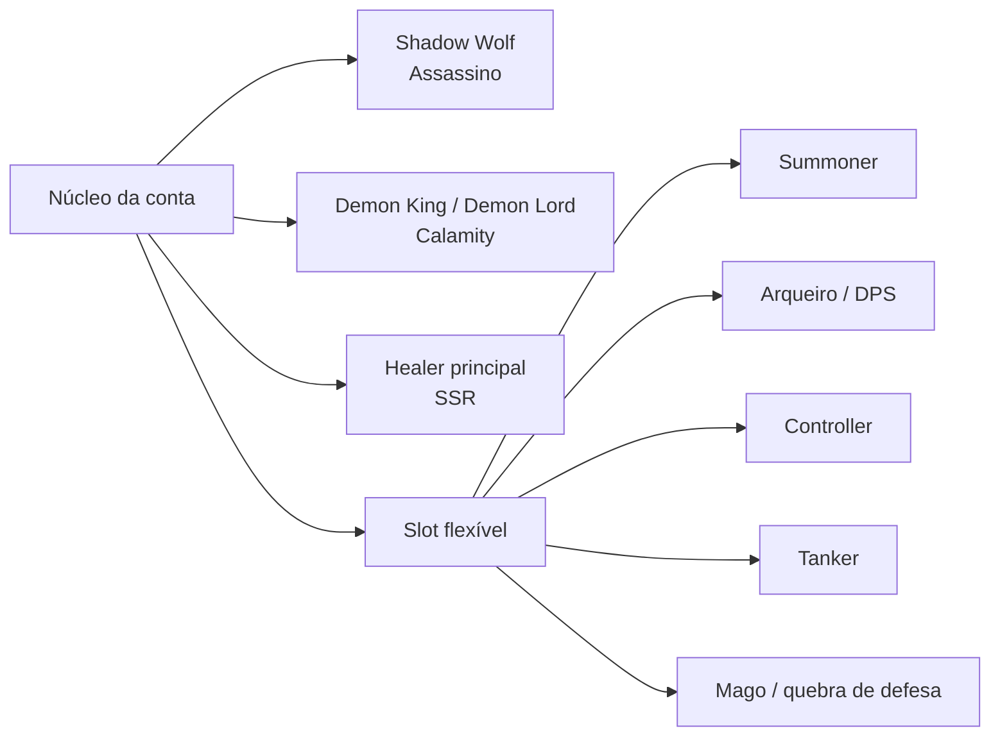
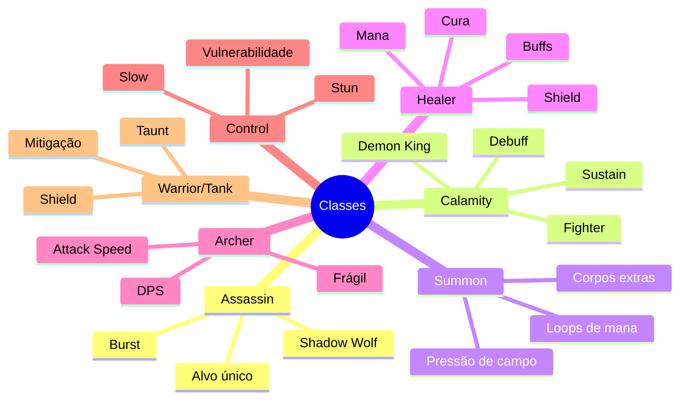
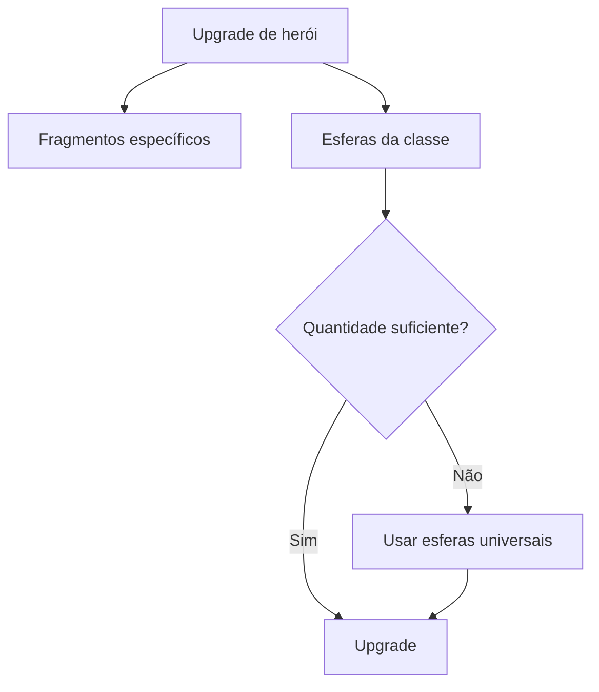
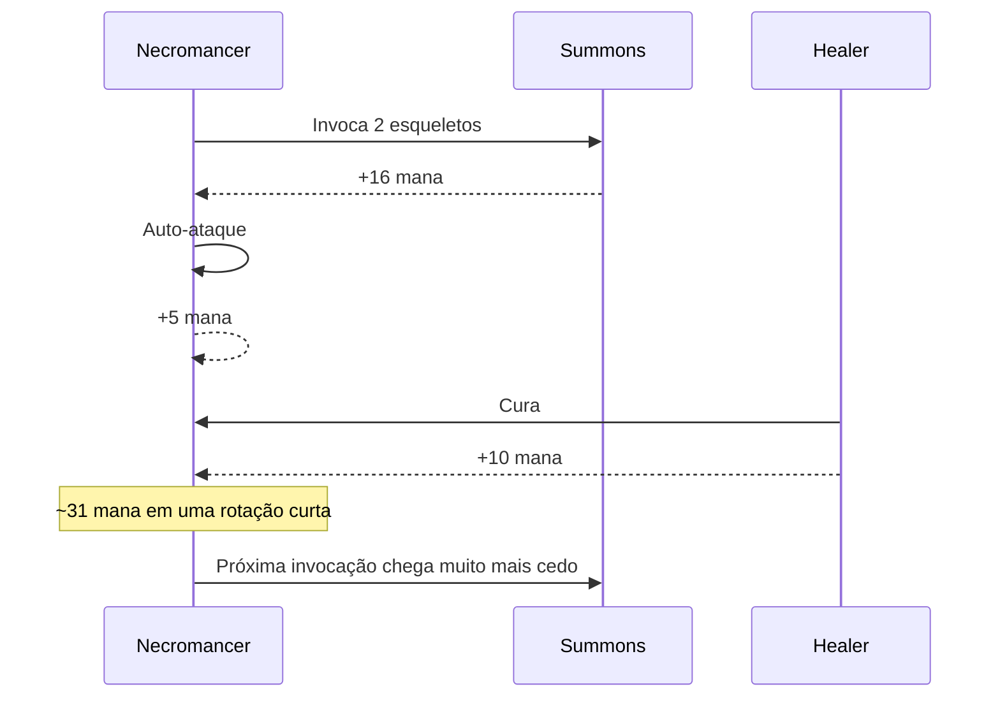
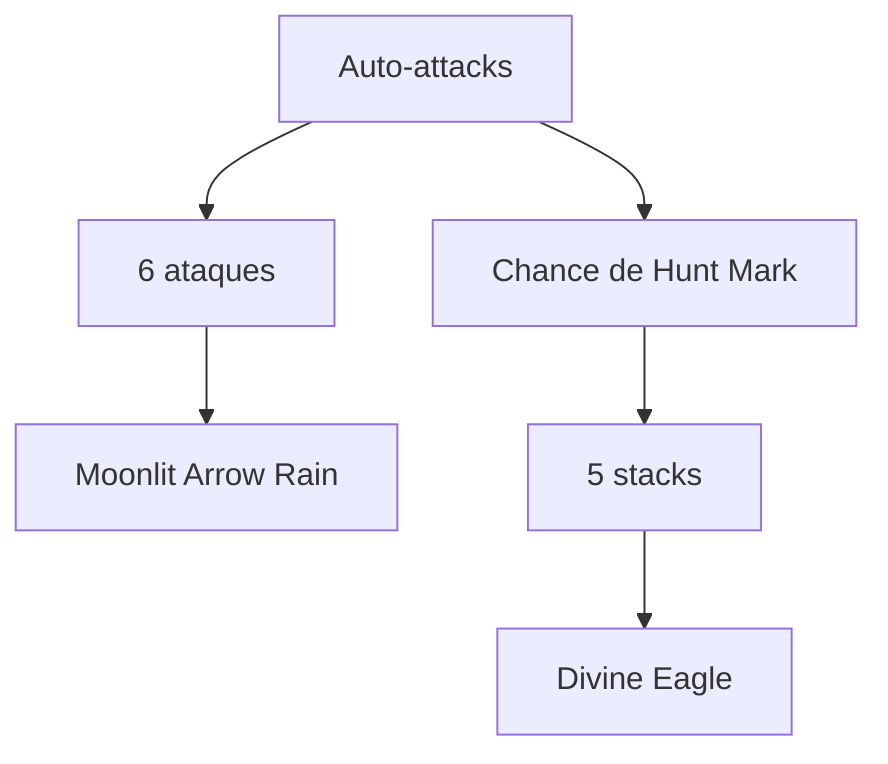
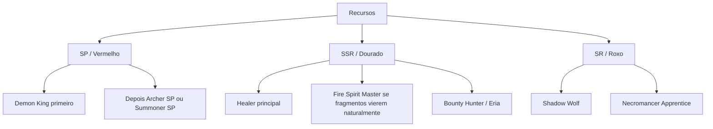
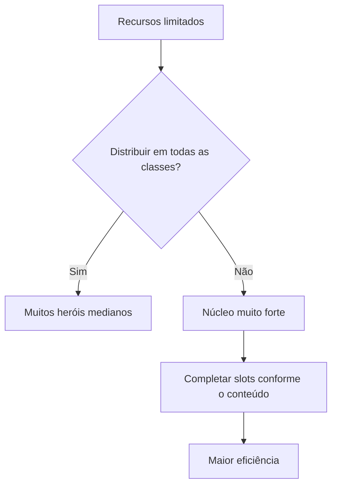

# Guia geral — personagens, classes e sistemas

> Documento vivo baseado nos testes, prints e observações de jogo já registrados. Onde o jogo não mostra números exatos, o texto marca a informação como **observada**, **estimada** ou **a confirmar**.

## Visão rápida

O jogo gira menos em torno de montar uma composição fixa com uma unidade de cada classe e mais em torno de construir um **núcleo forte** e completar os slots restantes conforme o estágio ou chefe.



A lógica prática observada até agora é:

- **Shadow Wolf** funciona como carry universal de alvo único e escala muito com Blood e efeitos de baixo HP.
- **Demon King / Demon Lord** cumpre duas funções ao mesmo tempo: frontline e dano, graças a Fear/Nightmare e sustain.
- **Healer** mantém o grupo vivo e, em alguns kits, acelera a rotação de skills ao restaurar mana.
- **Summoner** cria volume de campo, divide o foco inimigo e pode formar loops de mana extremamente fortes.
- **Arqueiro**, **Controller**, **Tanker** e **Mago** são mais dependentes da luta e da conta.

---

# 1. Classes conhecidas



## Assassino

Classe ofensiva de explosão e alvo único. O **Shadow Wolf** é atualmente a referência da conta por conseguir escalar absurdamente com Blood e efeitos condicionais de HP.

## Calamity

Na prática funciona como um fighter/tank híbrido. O grande diferencial é não ser apenas uma parede: aplica debuffs como **Fear** e/ou **Nightmare**, causa dano real e recupera vida durante a luta.

Isso reduz muito a necessidade de investir cedo em um Tanker dedicado.

## Summoner

Classe extremamente valiosa porque o summon não é apenas dano: ele também serve de **corpo extra para receber ataques**. Em fases em que inimigos focam backline ou menor HP, essa pressão de campo pode valer mais do que um Tanker puro.

## Healer

Uma das classes mais importantes para a composição. Além de cura, alguns kits oferecem shield, buffs, attack speed e restauração de mana.

## Archer

Pode atingir DPS muito alto quando recebe investimento, mas sofre com fragilidade. É especialmente vulnerável a inimigos que pulam na backline ou focam unidades de menor HP.

## Control

Possui stun, slow, redução de dano e aumento de dano recebido pelo inimigo. Até agora, o problema observado é que o controle costuma durar pouco e a frequência de cast não compensa o slot em muitas situações.

## Warrior / Tank

Especializado em mitigação, shield, taunt, self-heal e sobrevivência. É muito resistente, mas geralmente oferece pouco dano comparado a um Calamity bem desenvolvido.

---

# 2. Raridades

Ordem registrada:

**R (azul) → SR (roxo) → SSR (dourado) → SP (vermelho) → UR**

A raridade afeta fortemente atributos base e normalmente também a complexidade do kit.

### Tendência observada

- **R / azul:** kit simples, útil principalmente no começo e para bônus globais/profissão.
- **SR / roxo:** alguns personagens já possuem kits comparáveis a SSR e custo de evolução muito mais amigável.
- **SSR / dourado:** bom equilíbrio entre atributos, kit e disponibilidade de fragmentos.
- **SP / vermelho:** muito forte, porém fragmentos são raros e caros.
- **UR:** atributos e kit excelentes, mas evolução pode depender de fragmentos muito difíceis ou pagos.

---

# 3. Sistema de evolução

A evolução de nível usa dois recursos simultaneamente:

1. **fragmentos do herói**;
2. **esferas/bolinhas da classe**.

Existem também **esferas universais/coringa**, usadas para completar a quantidade necessária de esferas da classe.



Faixas observadas de fragmentos:

| Faixa aproximada | Fragmentos necessários |
|---|---:|
| níveis iniciais | 5 |
| progressão intermediária | 10 |
| aproximadamente 10–15 | 30 |
| aproximadamente 15–20 | 60 |
| níveis superiores | **a confirmar** |

A quantidade de esferas da classe também cresce bastante com o nível.

---

# 4. Mana = “cooldown” do jogo

Uma das descobertas mais importantes é que o jogo usa a **barra de mana como mecanismo de recarga das skills**.

Na prática, efeitos descritos como aceleração de cooldown frequentemente funcionam como **restauração de mana**.

## Valores observados

Na Necromancer Apprentice:

- auto-ataque: **+5 mana** observado;
- efeito de summon: **+8 mana por esqueleto**;
- ao invocar dois esqueletos: **+16 mana**;
- cura da healer com efeito de restauração: **+10 mana**.

Um ciclo observado pode gerar aproximadamente:

```text
+16 (dois summons)
+5  (auto-ataque)
+10 (cura)
= +31 mana em uma janela curta
```

Esse comportamento explica por que certas composições conseguem castar skills quase em sequência.



---

# 5. Personagens registrados

## Shadow Wolf — SR Assassin

Papel principal: **carry / boss killer**.

Pontos fortes registrados:

- escala muito com Blood;
- pode atingir números absurdos de ataque com stacks;
- possui sustain situacional;
- grande dano em alvo único;
- excelente contra chefes quando consegue permanecer vivo.

Uma skill inicial observada aumenta a duração de **Bloodlust**, o que é excelente para o kit. Outra aumenta esquiva após matar inimigo, útil para sobrevivência, mas geralmente menos valiosa que opções ofensivas em builds de boss.

### Build de referência observada

- dupla mordida / efeitos ligados a Bite;
- Blood melhorado;
- efeito de múltiplos hits;
- bônus de dano em HP baixo;
- manutenção de Blood próximo do máximo.

---

## Demon King / Demon Lord — SP Calamity

Papel principal: **frontline híbrido + dano + sustain**.

Por que é prioridade de investimento:

- substitui parcialmente o Tanker;
- aplica Fear e/ou debuffs relacionados;
- se cura enquanto luta;
- possui HP suficiente para segurar frontline;
- ainda entrega dano alto.

A estratégia de conta mais eficiente até agora é investir recursos vermelhos primeiro nele até o custo de evolução ficar muito alto e só então abrir um segundo projeto SP.

---

## Necromancer Apprentice — SR Summoner

Um dos personagens mais interessantes descobertos até agora.

Skills registradas:

| Skill | Efeito |
|---|---|
| Skeleton Strengthening | Skeleton Warrior evolui |
| Sea of Dead Bodies | número de esqueletos invocados +1 |
| Corpse Transfer | morte de esqueleto pode invocar Skeleton Mage |
| Dead Recharge | invocar esqueletos restaura mana |
| Skeleton Resurrection | esqueletos podem ressuscitar |
| Scourge of the Undead | duração dos esqueletos dobrada |
| Skeleton Advanced | Skeleton Warrior evolui para Skeleton King |

### Loop de invocação


O efeito visual e a pressão de campo podem ficar extremos, chegando a encher a tela de esqueletos.

### Observação de eficiência

A variante com ressuscitar em Skeleton Mage foi divertida, mas em testes preliminares o dano total não acompanhou a escalada de HP dos inimigos quando o tempo da fase avançou.

Hipótese de build melhor:

- priorizar quantidade de summons;
- mana por summon;
- duração dobrada;
- evolução para Skeleton King;
- sacrificar alguma sobrevivência em favor de dano, se necessário.

---

## Fire Spirit Master / Mia Morning Dew — SSR Summoner

Papel: **summoner ofensiva / DOT / pressão de campo**.

Atributos observados no Lv.14:

- ATK: **12.7K**
- HP: **158.87K**
- DEF: **5607**
- Combat Power: **14160**

Comparada à Necromancer SR Lv.13, apresenta vantagem aproximada de:

- ~1K de ATK;
- ~20K de HP;
- ~700–1000 de DEF.

Isso mostra bem o ganho de raridade, embora a SR tenha custo de evolução significativamente melhor.

Skills registradas incluem:

- Fire Element causar dano ao morrer;
- Fire Element causar dano em área ao redor por segundo;
- efeitos ligados a quantidade de summons;
- progressão futura em que a morte de Fire Elements aumenta o dano de aliados.

Uma build potencial de spam pode combinar:

- começar com múltiplos elementais;
- +1 quantidade de summon;
- mana quando summon morre;
- sinergia com healer de restauração de mana.

---

## Artemis — UR Goddess of the Hunt

Papel: **Archer DPS de alto teto**.

Atributos observados no Lv.2:

- ATK: **14.51K**
- HP: **180.9K**
- DEF: **6377**
- Combat Power: **16147**

Apesar do nível extremamente baixo, seus atributos já superam vários SSR muito mais evoluídos.

### Mecânicas principais

#### Moonlit Arrow Rain

Após **6 ataques**, dispara **7 moonlight arrows** em inimigos aleatórios.

#### Hunter God Mark

Ataques podem aplicar **Hunt Mark**. Ao atingir 5 stacks, consome as marcas e invoca uma **Divine Eagle** para atacar o alvo.

Artemis possui, portanto, dois motores de dano paralelos:



### Skills vistas

**Hunt Mark:**

- Precision — aumenta muito a chance de Hunt Mark;
- Rapid Fire — após aplicar Hunt Mark, próximo ataque acerta 3 vezes;
- Divine Eagle — com 3 stacks invoca águia que ricocheteia entre inimigos;
- Spirit Blessing — ao ativar Hunter Deity Mark, aumenta permanentemente ataque e HP do companheiro, até 30 stacks;
- Pursuit — em 5 stacks ativa dano em área extra.

**Moonlit:**

- Enhancement — +4 flechas e +50% dano;
- Haste — requisito de ativação da chuva -2 ataques;
- Charge — interage com Hunt Mark para dano pesado extra;
- Chain Break — repetição no mesmo alvo ativa dano em área;
- Star Piercer — auto-ataques podem disparar flecha que ignora defesa e acelera a chuva;
- Moon Goddess Descends — a cada 2 casts de Moonlit Arrow Rain, dispara rapidamente 13 flechas; hits consecutivos aumentam o dano posterior.

### Estratégia de investimento

Artemis é forte demais para ser descartada enquanto seus atributos permanecem acima dos demais arqueiros, mas sua evolução é financeiramente muito cara.

Plano racional:

1. usar enquanto ela tiver vantagem clara de atributos/dano;
2. não comprar fragmentos adicionais de forma agressiva;
3. aproveitar fragmentos gratuitos/eventos;
4. migrar para SSR/SP quando ultrapassarem seu desempenho real.

---

## Eria Ironwing — SSR Bounty Hunter

Papel: **Archer de DPS sustentado baseado em munições e attack speed**.

Atributos observados no Lv.10:

- ATK: **11.31K**
- HP: **141.45K**
- DEF: **4991**
- Combat Power: **12612**

### Mecânica base — Let the Bullets Fly

Após **8 ataques**, libera uma barragem de tiros com dano massivo.

### Skills registradas

- Ammunition · Steel Core — ataques normais podem ativar bala especial e dano adicional;
- Ammunition · Mercury — tiros podem aplicar dano crescente no mesmo alvo;
- Ammunition · Explosion — chance de explosão em área;
- Ammunition Expert — cada tipo de Special Bullet aumenta ATK, até 50 stacks;
- Spearmanship · Kinetic Energy — cada ataque aumenta attack speed;
- Spearmanship · Double Shot — chance de ataque em rajada;
- Gunsling · Loading — antes de Wild Barrage, attack speed +200%;
- Gunsling · Frenzy — Wild Barrage aumenta attack speed;
- Gunsling · Improvement — casts de Wild Barrage aumentam quantidade de bullets da próxima;
- Ammunition · Tear — a cada 2 hits de bala especial, causa uma instância adicional de dano massivo;
- Call for Support — pode marcar alvo e chamar bombardeio;
- Barrage Time — Let the Bullets Fly pode ricochetear 1 vez;

Progressão vista:

- Lv.3: começa com Steel Core;
- Lv.5: attack speed aumenta após Wild Barrage;
- Lv.8: começa com Reload;
- Lv.10: Bounty aumenta dano recebido pelo alvo e Let the Bullets Fly recebe bônus;
- Lv.15: Wild Rapid Fire +5 bullets;
- Lv.20: melhora Bounty e ricochete de Barrage.

### Potencial

É uma das melhores candidatas para substituir Artemis no futuro porque:

- fragmentos SSR são muito mais acessíveis;
- o kit possui escalada própria de attack speed, munições e stacks de ATK;
- a performance cresce muito com níveis que liberam efeitos iniciais gratuitamente.

---

## Veliana Purple Flame — SP Light Archer

Papel: **Archer SP focada em janela de Demon-Banishing State**.

Mecânica base:

- a cada **5 ataques**, entra por **4 s** em Demon-Banishing State;
- durante o estado, causa dano extra e pode disparar Light Arrow.

Skills vistas:

- ataques ricocheteiam 2 vezes durante o estado;
- Light Arrow aumenta attack speed;
- ataques no mesmo alvo aumentam crit gradualmente;
- Light Arrow pode exigir 2 ataques a menos;
- Light Arrow ganha dano a cada 3 ataques;
- attack speed +105% no estado;
- atacar o mesmo alvo 3 vezes causa dano adicional;
- Light Arrow causa dano extra.

No Lv.1 já apresenta atributos altos para o nível, mas a evolução SP é muito mais difícil.

É candidata forte para um futuro projeto vermelho voltado a boss DPS, porém compete diretamente por recursos SP com o Demon King.

---

## SSR Pharaoh — Karin — Control

Papel: **stun / debuff / suporte ofensivo**.

Atributos observados no Lv.10:

- ATK: **10.29K**
- HP: **157.17K**
- DEF: **5547**
- Combat Power: **12642**

### Solar Flare

Aplica stun em um inimigo e emite Solar Beams horizontais.

Skills vistas:

- Flare · Echo — quantidade de Solar Flare +1;
- Flare · Continuation — stun +1 s;
- Flare · Instant — ataques básicos podem stun por 2 s;
- Flare · Weakness — após stun, reduz attack speed do inimigo;
- Flare · Vulnerable — inimigos stunados recebem mais dano;
- Beam · Dazzle — Sun Beam pode stun;
- Beam · Vulnerable — aumenta dano recebido pelo inimigo e pode acumular;
- Beam · Encouragement — aumenta dano aliado;
- Beam · Weakness — aumenta crit rate do inimigo / tradução provavelmente inconsistente; **a confirmar**;
- Beam · Weakness (ou variação) — reduz levemente dano causado pelo inimigo.

### Avaliação atual

Mesmo com kit interessante no papel, controle tem mostrado baixa eficiência prática porque:

- duração de stun é curta;
- casts não acontecem rápido o suficiente;
- muitos encontros são melhor resolvidos com dano ou sustain.

É, portanto, uma classe situacional e de baixa prioridade de investimento.

---

## SSR Holy Knight — Serena Dawn — Warrior/Tank

Papel: **tank puro com shield, mitigação e taunt**.

Atributos observados no Lv.10:

- ATK: **7199**
- HP: **204.32K**
- DEF: **7210**
- Combat Power: **12731**

O contraste com classes de DPS é evidente: HP e DEF muito maiores, porém ATK muito menor.

### Sacred Wing Shelter

Ganha Sacred Crest Mark; cada stack aumenta Damage Reduction, até 5 stacks.

Skills vistas:

- Shelter · Guard — shield de HP máximo para si e aliado de menor HP;
- Shelter · Shield — chance de ganhar shield ao ser atacado;
- Shelter · Cure — chance de recuperar HP máximo a cada segundo;
- Shelter · Continuation — duração de Holy Wings +3 s;
- Mark · Shield — ganha shield por stack de Holy Emblem Mark;
- Mark · Haste / Rapid — gera Holy Emblem Mark a cada 3 s;
- Imprint · Resonance — ataques normais podem gerar marca;
- Imprint · Sublimation — limite de marcas +5;
- Imprint · Free of Control — com 10 stacks, imunidade a controle;
- Asylum · Suppression — reduz attack speed de inimigos próximos.

### Avaliação

Excelente para conteúdo de dano extremo, mas de baixa prioridade geral porque o Demon King cobre boa parte da função defensiva enquanto ainda contribui com dano.

---

## R Piggy Vanguard — Peggy — Warrior/Tank

Exemplo claro da filosofia dos heróis azuis.

Atributos observados no Lv.16:

- ATK: **7108**
- HP: **202.06K**
- DEF: **7135**
- Combat Power: **12586**

### Kit

- Ancestral Protection — entra em Ancestral Blessing, ganha redução de dano e shield a cada 3 casts;
- shield por segundo;
- duração da bênção dobrada;
- chance de shield ao atacar/ser atacado;
- aumento forte de redução de dano com shield;
- cura própria a cada 3 skills;
- aumento de attack speed a cada 2 skills;
- ultimate de grande shield ao fim da bênção.

O kit é funcional, mas é muito mais simples e possui menos camadas de interação do que os kits SR/SSR/SP/UR.

---

# 6. Composição e prioridade de conta

Estratégia atual considerada eficiente:



### Prioridades atuais

**SP:** Demon King até o custo ficar alto demais; depois abrir um novo projeto vermelho.

**SSR:** Healer principal como investimento prioritário; Fire Spirit Master e Eria conforme recursos e fragmentos disponíveis.

**SR:** Shadow Wolf e Necromancer Apprentice.

**Baixa prioridade:** Tanker dedicado, Controller dedicado e unidades R, salvo conteúdo muito específico.

---

# 7. Composições sugeridas

## Padrão de campanha / progressão

```text
Demon King
Shadow Wolf
Healer
Summoner
Slot flexível
```

## Boss de dano alto

```text
Demon King
Shadow Wolf
Healer
Summoner
DPS flexível
```

O Summoner funciona como “massa de carne” adicional para dividir ataques.

## Boss de defesa alta

Adicionar mago ou unidade com:

- redução de DEF;
- ignore DEF;
- aumento de dano recebido.

## Boss que precisa de interrupção

Adicionar Controller apenas quando o stun/slow realmente impedir uma habilidade perigosa.

## Boss DPS puro

Possível trio ofensivo futuro:

```text
Demon King + Shadow Wolf + SP Light Archer
```

com Healer e um quinto slot flexível.

---

# 8. Equipamentos, gemas e refino

Além dos heróis, a conta possui três sistemas importantes de escala.

## Gemas

Gemas podem conceder bônus como:

- Adventurer Attack;
- Archer Damage %;
- Mage Damage %;
- Pet Attack;
- Adventurer Damage %.

A estratégia observada prioriza **dano**.

## Refino

Efeitos registrados incluem:

### Stage Mastery

Aumenta **Stage Battle Damage**.

Exemplo observado: **+5.62%**.

### Master of All Trades

Ao usar 4 classes diferentes:

- All Damage +6.06%;
- Damage Reduction +6.06%.

Esse efeito recompensa composição variada sem exigir que todas as classes estejam igualmente investidas.

---

# 9. AFK e Raid

A campanha gera recursos offline.

Exemplo observado no estágio 69 — Leafwhisper:

- **361 ouro/hora**;
- **16 recurso/hora**.

Raid consome energia e concede instantaneamente recompensas equivalentes ao estágio.

Drops vistos incluem:

- ouro;
- EXP;
- tickets;
- equipamentos;
- esferas de classe;
- gemas;
- outros materiais de progressão.

---

# 10. Loja aleatória

A Random Shop pode oferecer:

- Hero Summon Ticket;
- Gem Cube;
- fragmentos de heróis;
- Pet Eggs;
- outros recursos.

Refresh observado: **600 ouro**.

É uma fonte importante de fragmentos baratos de heróis R/SR/SSR ao longo do tempo.

---

# 11. Filosofia de construção de conta

A principal conclusão até agora é que o jogo recompensa **especialização**, não distribuição uniforme.



Em vez de manter sete classes igualmente evoluídas, faz mais sentido:

1. maximizar personagens que cobrem múltiplas funções;
2. aproveitar heróis SR baratos com kits excepcionalmente fortes;
3. usar SSR onde a progressão é sustentável;
4. concentrar fragmentos SP em poucos projetos;
5. deixar Controller/Tanker como ferramentas situacionais até o conteúdo realmente exigir.

---

# 12. Informações ainda a confirmar

- custo exato de fragmentos acima do Lv.20;
- quantidade total de mana necessária para cada cast;
- se todas as classes ganham +5 mana por auto-ataque ou se é específico por personagem;
- valores exatos de mana restaurada por determinadas skills;
- duração e coeficientes de várias skills;
- comportamento exato de alguns textos mal traduzidos;
- ultimates ainda não desbloqueadas de alguns SP/SSR;
- kit completo da Summoner SP de água;
- comparação prática entre Artemis, Eria e Veliana em níveis/atributos equivalentes.

---

# 13. Próximos testes úteis

1. medir mana inicial, mana por auto-ataque e custo de skill em vídeo/prints sequenciais;
2. testar Necromancer com e sem Skeleton Resurrection;
3. comparar dano da Necromancer com Fire Spirit Master em estágios equivalentes;
4. registrar o kit completo da healer SSR;
5. registrar o kit completo do Demon King;
6. registrar a Summoner SP de água quando disponível;
7. comparar Artemis vs Eria quando o Combat Power ficar próximo;
8. registrar dano de boss com e sem Controller;
9. registrar impacto real de Stage Mastery e Master of All Trades.

---

## Regra editorial da wiki

Sempre separar claramente:

- **texto confirmado pelo jogo**;
- **valor observado em print/teste**;
- **hipótese de mecânica**;
- **avaliação estratégica da conta**.

Isso evita transformar tradução ruim ou impressão de gameplay em “fato” sem teste suficiente.
